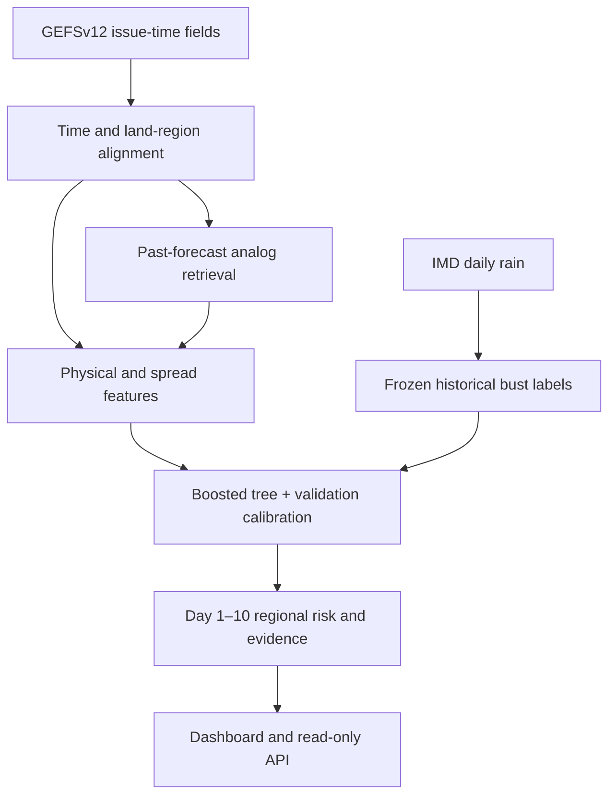

# SIH 26079 — Forecast Bust Detection: canonical research and build reference

**Decision edition:** 26 September 2026 · **Audience:** data, ML, API, design, video and PPT teams · **Status:** research and architecture, not measured model performance.

> **Evidence key.** **[HIGH]** means the stated external fact was checked against the linked primary source. **[MEDIUM]** means two or more supplied drafts agree but this review did not independently verify that exact claim. **[LOW]** means a single draft made an unverified claim; do not use it as a build dependency or slide fact. **[DESIGN]** marks *our proposal, target, convention or inference*, not a claim about the outside world. Every substantive statement below carries one of these tags. A source proves the availability or specification it describes; it does **not** prove a particular account can download every desired file today. Links in the source appendix are part of this document.

**Input IDs:** D1 Elicit brief; D2 *Master Strategy Dossier*; D3 *Deep Research Compendium*; D4 *Forecast Bust Detection Research.md*; D5 DeepSeek; D6 Grok; D7 z.ai. [DESIGN] All seven were treated as drafts, irrespective of their internal “verified” labels.

## 1. Executive synthesis

| Question | Final answer |
|---|---|
| What are we predicting? | **[DESIGN]** Before observations arrive, estimate the probability that a **specified model's 24-hour rainfall forecast** for an Indian region and lead day 1–10 will have an unusually large error. This is a prediction about forecast reliability, rather than a new rainfall forecast. |
| What's actually new? | **[DESIGN]** Combine a region/season/lead-aware error threshold, ensemble disagreement, physical forecast-pattern descriptors and *past analog forecasts with known subsequent errors*; calibrate the resulting probability and show the reasons and out-of-time evidence. Do not claim world-first status: existing probabilistic post-processing and analog methods are prior art. |
| Which forecast? | **[HIGH]** NOAA's open GEFSv12 **reforecast**, 00 UTC, 2000–2019, normally five members, up to day 16; most fields through day 10 are archived at 0.25°, while pressure levels above 700 hPa are 0.5°. Use its **control-member rainfall** as the named forecast being audited, and the five-member spread as a predictor. [S1–S2] |
| Which verification reference? | **[HIGH]** IMD's 0.25° daily gridded land rainfall archive explicitly lists 1901–2024, sufficient overlap with the reforecast period. [S3] **[DESIGN]** It is a gauge-based gridded estimate, not error-free ground truth; mask missing and low-coverage cells. |
| What do we ship? | **[DESIGN]** A Day 1–10 historical issue-time replay, 2° land-region risk map, calibrated probability, forecast/verification provenance, similar past cases, physically named feature contributions, reliability evidence and a read-only API. The demo must visibly state **“GEFSv12 reforecast research prototype; not NCUM/NEPS operational validation.”** |
| Why this direction? | **[DESIGN]** D2's U-Net offers a visually attractive map but increases storage, compute and explanation risk without fixing historical archive or leakage problems. D1/D3/D4/D5/D6/D7 mostly favor trees, analogs or both. A boosted-tree model with an analog-error module makes the historical comparison tangible and can be validated on a laptop; the map comes from regional predictions. |
| Gate before claiming success | **[DESIGN]** Report held-out Brier score and Brier skill versus training-era climatology, PR-AUC, reliability and recall at a fixed alert budget, by lead bucket and season. If the model fails to beat climatology on the untouched test years, show the baseline and the limitation honestly. |

**The one-sentence pitch:** **[DESIGN]** *Given a GEFS forecast that was available at issue time, we estimate where its Day 1–10 rain forecast is unusually likely to fail, explain which measurable signals drove that estimate, and show whether those probabilities matched subsequent observations.*

## 2. Verified domain knowledge base

### 2.1 Forecasting and verification

| Claim | Build implication |
|---|---|
| **[HIGH]** Numerical forecasting assimilates observations into an analysis and evolves it forward; ERA5 describes this analysis/forecast cycle and is a reanalysis, not a direct station observation. [S4] | **[DESIGN]** Never use a later analysis, observation or retrospective regime tag among issue-time predictors. |
| **[HIGH]** NCMRWF's public SWFDP description lists NCUM N1024L70 at about 12 km, 00/12 UTC forecast runs to 10 days, and NEPS with one control plus 22 perturbed members to 10 days. [S5] | **[DESIGN]** Cite this as institutional context, not as the specification of our GEFS-trained classifier. |
| **[HIGH]** The TIGGE *archive entry* lists thirteen contributing centres and heterogeneous 0.12°–0.9375° archived resolutions, 10–15-day typical forecasts. [S6] The TIGGE licence includes both IMD and NCMRWF, with their data under CC BY-NC 4.0 and a 48-hour access delay. [S7] | **[DESIGN]** A licence listing does not verify continuous completeness for a particular centre/date/variable; do a sample retrieval before planning any NCUM/NEPS result. |
| **[HIGH]** The ECMWF TIGGE model table lists an **11+1 archived NCMRWF contribution** for the displayed model configuration, whereas NCMRWF's public operational page describes **22 perturbed + control**. [S5, S8] | **[DESIGN]** Label archived and operational ensembles separately. Never call TIGGE's 12 members a 23-member NEPS archive. |
| **[HIGH]** NCMRWF's reports employ contiguous-rain-area (CRA) spatial verification for rainfall objects. [S9] | **[DESIGN]** Report region or neighborhood error and optionally a displaced-rain sensitivity check; pixelwise error alone double-penalizes displaced storms. |
| **[HIGH]** ERA5 single-level atmospheric data are hourly on a 0.25° distribution grid, updated with roughly five-day latency; they remain model-informed estimates. [S4] | **[DESIGN]** Use ERA5 as optional context or circulation verification, never describe it as exact truth or as a real-time feature at issue time. |
| **[DESIGN]** MAE/RMSE quantify magnitude, Brier score measures binary probability error, a reliability plot compares forecast probability bins with realised frequency, and PR-AUC helps rank relatively rare busts. | **[DESIGN]** Define the event *first*, then compute metrics on untouched time blocks; a high classifier accuracy is not the success criterion. |

### 2.2 How named weather situations create distinct failure modes

These are **physical hypotheses and feature choices**, not a claim that our model has learned a causal mechanism. A system tag is a *forecast-time descriptor* unless a separately verified event catalogue is available at issue time. [DESIGN]

| Situation | Plausible failure pathway and evidence grade | Issue-time feature / test |
|---|---|---|
| Monsoon depression | **[MEDIUM]** D3/D4/D5/D6/D7 agree that vortex location or genesis, moisture inflow and convection can shift rain belts; the exact magnitude and case-specific cause are unverified here. | **[DESIGN]** 850-hPa winds/vorticity, MSLP minimum, precipitable water, neighboring heavy-rain probability; assess east/west displacement sensitivity. |
| Western disturbance | **[MEDIUM]** D3/D4/D5/D6/D7 connect upper-level trough/jet phase and Himalayan terrain to precipitation placement; no quantified India-specific failure rate was verified. | **[DESIGN]** 500-hPa height gradient, 250-hPa winds if archive and budget allow, topographic region and ensemble spread; report winter subset. |
| Heat wave | **[MEDIUM]** D3/D5/D6/D7 identify ridge, soil moisture, cloud/radiation and near-surface temperature biases as candidates; attribution in an individual event requires further evidence. **[HIGH]** IMD's heat-wave definition is based on temperature/departure and station criteria, not merely a universal 40°C rule. [S10] | **[DESIGN]** A separate Tmax-event/temperature-error label after rain MVP; never reuse the rain-bust probability as heat-wave probability. |
| Tropical cyclone | **[MEDIUM]** D3/D4/D5/D6/D7 identify track/steering, intensity and rainband displacement as separate error modes. **[HIGH]** IMD RSMC provides a best-track archive. [S11] | **[DESIGN]** Track-error task needs forecast tracks and storm identifiers plus best tracks; keep as a separate research extension. A rain map alone does not validate cyclone-track bust detection. |
| Active/break monsoon | **[MEDIUM]** D3/D5/D6/D7 associate phase/propagation and monsoon trough changes with predictability; no measured sensitivity has been established for this model. | **[DESIGN]** Rain anomaly and forecast-pattern regime from fields available at issue time; compare JJAS performance by forecast regime. No observed future phase label as predictor. |

**[DESIGN]** The MVP can show all five as meteorological context in its research notes, while the trained probability and reported scores refer only to **daily rainfall error**. This boundary prevents hazard labels from becoming an unsupported multi-hazard claim.

## 3. Final dataset decision

**Traffic light:** Green = publicly described direct access with manageable targeted subset; Yellow = account, large transfer, variable availability or processing uncertainty; Red = no confirmed usable historical file route for the required task. The rating is a **project-risk judgment [DESIGN]**, while each listed specification is separately graded.

| Dataset / role | Variables, grid and period | Access and difficulty | Confidence / decision |
|---|---|---|---|
| **NOAA GEFSv12 reforecast — primary forecast** | **[HIGH]** 00 UTC daily; five members normally, 2000–2019 cloud listing; 16-day lead. Precipitation `apcp_sfc`, MSLP, PWAT, 850-hPa wind/humidity, 500-hPa height; 0.25° for most day-1–10 fields, **0.5° above 700 hPa**; some 3/6-hour accumulation distinctions. [S1–S2] | **[HIGH]** Public S3 GRIB2, no AWS account required; source has a bucket listing example. [S1] **[DESIGN] Yellow** because regional byte-range/file-name retrieval and size must be piloted. | **[HIGH]** Specifications. **[DESIGN] Chosen** as the only MVP forecast family. Use control-member rain as target forecast, other members as issue-time predictors. |
| **IMD 0.25° daily rainfall — primary verification reference** | **[HIGH]** Daily mm on India land grid, public catalogue 1901–2024, 135×129, yearly binary/NetCDF listings. [S3] | **[HIGH]** IMD Pune annual-selection page. **[DESIGN] Yellow** until two years are actually downloaded and decoded; D4/D6 called it Green while D3 warned of site friction. | **[HIGH]** Product metadata. **[DESIGN]** Align daily timestamps by testing station/day convention and a few known dates, then area-weight within the common land mask. |
| **ERA5 — optional atmospheric context/reference** | **[HIGH]** Single-level hourly 0.25° distributed grid, 1940–present; pressure-level product separately available. [S4, S12] | **[HIGH]** CDS account/API and terms. [S13] **[DESIGN] Yellow** for queue/volume; no requirement for first rain model. | **[HIGH]** Metadata. **[DESIGN]** Only initialization-time reanalysis available then may enter replay features; easier is GEFS-only features. |
| **TIGGE — optional institutional/multicentre retraining** | **[HIGH]** Centre-specific variable, grid and date coverage, including NCMRWF and IMD in licence; no single “TIGGE = 0.5°” resolution. [S6–S8] | **[HIGH]** ECDS registration, 48-hour delayed availability, provider-specific CC BY/NC. [S7] **[DESIGN] Yellow/Red** for hackathon training volume; sample retrieval required. | **[HIGH]** Catalogue/licence. **[DESIGN]** Do not merge with GEFSv12 training features; evaluate as a new model/domain if acquired. |
| **IMDAA — optional Indian reanalysis** | **[HIGH]** NCMRWF lists 12-km regional reanalysis through 2020; the foundational published study describes 1979–2018, explaining draft date discrepancies. [S14–S15] | **[HIGH]** Registration/login is visible at NCMRWF RDS. [S16] **[DESIGN] Yellow/Red** until approval and a selected-file download succeed. | **[HIGH]** Context and portal. **[DESIGN]** Independent comparison of reference sensitivity, not a mandatory predictor or “perfect truth.” |
| **IMD Tmax — future heat task** | **[HIGH]** 1° daily gridded Tmax listing reaches 2024, with a 1951 start. [S17] | **[DESIGN] Yellow** until annual files and time semantics are tested. | **[HIGH]** Product listing. **[DESIGN]** Separate temperature-label model; not mixed into rain target. |
| **NASA IMERG — future ocean/reference sensitivity** | **[HIGH]** 0.1°, half-hourly precipitation; Early/Late/Final have different latency/use cases. [S18] | **[DESIGN] Yellow** for product selection and account/data volume. | **[HIGH]** Metadata. **[DESIGN]** Not interchangeable with IMD gauge-grid land rain. |
| **NCMRWF NCUM/NEPS historical full fields — operational transfer target** | **[HIGH]** Systems and 10-day operations described by NCMRWF. [S5] **[LOW]** D5's FTP path and assumption of downloadable multi-year full fields were not confirmed. | **[DESIGN] Red** for direct historical access in this build; TIGGE may offer a constrained subset but its completeness needs a retrieval test. | **[DESIGN]** Request formal files and retrain/recalibrate before claiming NCUM performance. |
| **ECMWF open-data feed / recent GFS feed — demonstration only** | **[HIGH]** ECMWF's official endpoint retains only the recent 12 runs, roughly 2–3 days; NOAA says its common GFS cloud feed has a trailing ~30-day window. [S19–S20] | **[DESIGN] Green** for recent inspection; **Red** as a stand-alone multiyear training source. | **[HIGH]** Rolling limits. **[DESIGN]** Do not confuse with historical TIGGE or GEFS reforecast. |

### Exact rainfall-label protocol — freeze before training [DESIGN]

1. **Sample:** `(00 UTC initialization, valid day d=1…10, fixed 2°×2° India-land region)`; optionally render finer polygons by aggregation **without pretending finer resolution**. Forecast = GEFSv12 control `apcp_sfc`; predictors may use all five members. Store `init`, valid start/end UTC, GRIB step range, model version, source file, reference date and region ID. [DESIGN]
2. **Time alignment:** sum non-overlapping GEFS accumulation intervals over the precise 24-hour period represented by each IMD daily value; test whether its date labels the period ending at 03 UTC/08:30 IST, as described by an IMD-data evaluation paper [S21]. **[DESIGN]** Since 00 UTC runs are not aligned to 03 UTC boundaries, *derive* 03-to-03 totals from 3-hour steps (and document which day corresponds to nominal lead 1). **Important edge:** a nominal tenth 03-to-03 window can require a +243-hour forecast, whereas NOAA describes 3-hourly/0.25° data through +240 hours and 6-hourly/0.5° data beyond [S2]. **[DESIGN] NEEDS MANUAL VERIFICATION:** inspect actual +240/+246 precipitation step ranges. If the final three hours cannot be recovered exactly, either use a documented coarser 6-hour approximation with a sensitivity/error analysis and visually mark Day 10 “approximate,” or withhold Day 10 numerical skill and show it as unavailable. Do not silently compare 00–00 with 03–03 or invent a +243-hour value. A tested mapping on two annual files is a blocking acceptance gate.
3. **Spatial alignment:** decode both sources, harmonize longitude/CRS, conservatively or area-weightedly average rain to fixed regions, exclude ocean cells and require an explicit coverage fraction (proposed ≥80%). **[DESIGN]** Preserve observation and forecast region means, cell counts and missing flags. Do not interpolate observations to manufacture detail.
4. **Error and label:** `e = abs(F_control_24h − O_IMD_24h)` in mm/day. On **training years only**, estimate `q90(region, season=JJAS/non-JJAS, lead_bucket=1–3/4–7/8–10)` of `e`; label `bust = 1[e > max(q90, 10 mm/day)]`. **[DESIGN]** The 10-mm floor is a declared material-error policy, to be tested in a sensitivity table (5/10/20 mm), not a meteorological standard. Validation/test thresholds remain frozen; realised bust frequency need not equal 10%.
5. **Rare events:** use all examples initially, compare an unweighted model with one moderate positive-class weighting, then calibrate on held-out validation data (Platt/sigmoid as first choice; isotonic only if enough independent events). **[DESIGN]** Never use focal loss or `scale_pos_weight` as a magic claim; reweighting can distort probabilities. Report actual prevalence, PR-AUC, Brier/reliability and recall at a fixed number of regional alerts per day.
6. **Split:** train 2010–2015, validation 2016–2017, test 2018–2019 (dates contingent on the retrieval pilot). No random row split; group nearby forecast cycles for interval estimates and keep a named event wholly in one split. Fit thresholds, climatology, scalers, analog library, feature selection and calibrator on their permitted earlier periods only. **[DESIGN]** Retrieve analogs strictly from dates preceding each query initialization; for final test, training-era analog library is the conservative fixed option. Report test metrics once, with block bootstrap by week/episode.
7. **Baseline:** training-era empirical `P(bust | region, season, lead bucket)` with shrinkage to wider region/season when sparse; a second baseline uses ensemble spread alone. **[DESIGN]** Report Brier skill `1 − BS_model/BS_climatology`; if negative, do not claim improvement. Calibration is assessed on test, never fitted there.

**[DESIGN]** For a **10-day** forecast, a lead day is a *verifying 24-hour window*, not necessarily a GRIB step of `d×24` alone. Store and show the exact UTC interval and any boundary approximation in the dashboard. **[DESIGN]** The Day-10 cell stays gray if its time-window gate fails; the product target is Day 1–10, but completeness cannot be claimed before this check.

## 4. Final technical architecture

| Component | Frozen implementation |
|---|---|
| Inputs | **[DESIGN]** GEFSv12 control and five-member summaries available at initialization: region mean and upper quantile of forecast rain, rain spread and wet-member fraction, MSLP minimum/gradient, 850-hPa wind/moisture, PWAT, 500-hPa height at its archived 0.5° grid, season and lead. Static elevation may be added if sourced and documented. Keep features to roughly 15–25 named quantities. |
| Analog memory | **[DESIGN]** Standardize only on training years; compare forecast *patterns* over target and neighboring regions at the same lead bucket and season. Retrieve five nearest **earlier** initialization dates, use their error/bust fraction and distance as features, and display each forecast and subsequent IMD rain. If analog coverage is too sparse, use climatology fallback and label it. |
| Model | **[DESIGN]** One regularized LightGBM classifier with lead and season features and region ID; if package friction occurs, use scikit-learn histogram gradient boosting. Train small, tune on 2016–17; fit validation-only sigmoid calibrator. Output `P(defined rain bust)`, not an unqualified weather “confidence.” |
| Output | **[DESIGN]** `confidence_for_defined_event = 1 − calibrated_P(bust)` as a display complement. Also show numerical P, label definition, target model, reference and model version. A probability is not a guarantee of correct weather. |
| Evaluation | **[DESIGN]** Climatology and spread-only baselines, held-out Brier/Brier skill, reliability, PR-AUC, alert-budget recall; slices for Day 1–3, 4–7, 8–10, JJAS and other. Ablate analog features and physical features. Bootstrap weeks/episodes, not individual adjacent map cells. |
| Serving | **[DESIGN]** FastAPI + Parquet/SQLite artifacts + MapLibre/Leaflet or a simple static JS map. Endpoint `GET /v1/replay?init=2018-08-01&lead=5` returns GeoJSON features with `region_id, valid_start_utc, valid_end_utc, p_bust, tier, model, truth_source, threshold_mm, provenance`; `GET /v1/region/{id}` returns drivers/analogs; `GET /v1/evaluation` returns held-out metrics. Historical replay must not silently imply live deployment. |

### Choice against competing proposals

| Draft proposal | Disposition and reason |
|---|---|
| D2 U-Net spatial segmentation as MVP | **[DESIGN] Vision-only.** A dense colored map does not require pixel-level CNN training. Low independent event count, massive field storage, hard-to-audit leakage and weak local meteorological explanation outweigh appearance. |
| D1/D3/D4/D5/D6/D7 boosted tree | **[DESIGN] Primary.** Trainable from small regional tables, supports named features, time-block testing and practical calibration. Novelty sits in error target, analog memory and rigorous presentation. |
| D2 autoencoder analog latent embedding; D6/D7 direct analog retrieval | **[DESIGN] Direct analog retrieval inside the tree.** Transparent dates and realised errors are more inspectable than an unverified latent similarity percentage; ablate analog value. |
| D6/D7 TIGGE multi-centre disagreement, IMDAA | **[DESIGN] Stretch after access pilot.** A new centre's error distribution demands separate training and calibration; never treat multi-model disagreement as identical to single-ensemble spread. |
| D7 “distribution-free conformal guarantee” | **[DESIGN] Vision-only.** The quoted “90% of high-risk flags contain busts” is not a generic consequence of conformal prediction; finite-sample coverage assumptions and target definitions differ. Do not promise it. |

**Scope:** **[DESIGN] MVP** = rainfall only, GEFSv12/IMD, regional Day 1–10 replay, analogs, calibrated tree, baseline comparison, explanation, API/dashboard. **Stretch** = separate Tmax model; sampled TIGGE NCMRWF/IMD retraining; IMDAA sensitivity; an actual model-version bridge to recent GEFS and verified live inference. **Vision-only** = U-Net grid model, cyclone track/intensity classifier, fully operational NCUM/NEPS integration, forecaster feedback learning and national live alerting.

## 5. Explainability and dashboard/demo design

**Reason generator [DESIGN]:** compute TreeSHAP contributions on the **raw tree score**, group correlated variables into moisture, circulation, ensemble disagreement, analog-error memory and lead/season; then map the top 2–3 to conditional language: “Forecast members disagree about rain over the western neighboring cells” or “Comparable past forecast patterns had large errors at this lead.” Show feature value, comparable training range and the actual analog dates. SHAP describes this model's use of features, **not the physical cause** of the future error. The SHAP documentation describes its tree-output semantics. [S22] If a supposed synoptic reason lacks an actual field overlay, show it as a statistical signal rather than assert a mechanism. [DESIGN]

| Screen/sequence | Concrete UI and narration |
|---|---|
| 0. Provenance header | **[DESIGN]** “Research replay: GEFSv12 00 UTC init YYYY-MM-DD; Day d verifies UTC interval; IMD rain after verification.” Toggle *issued forecast* and *subsequent observed*; for an unverified future valid time, hide observed panel. |
| 1. National map | **[DESIGN]** Fixed 2° land cells or truthful aggregated subdivisions; Day 1–10 slider. Legend: **0–20% low**, **20–50% watch**, **50–100% high** *bust probability*, with gray no-data, using color plus labels/patterns. Tiers are presentation thresholds, not measured calibration bins. |
| 2. Regional drill-down | **[DESIGN]** Click cell: P(bust), `1−P` complement, train-era material-error threshold in mm/day, forecast-vs-IMD rain on replay, local model spread, lead-day probability curve. Keep “high uncertainty” and “high expected rain” separate. |
| 3. Why/analogs | **[DESIGN]** Two physical maps (forecast rain, member rain spread), top feature contributions with direction, five earlier analog dates and their actual errors; flag “no close analog” if appropriate. Do not invent a causal weather-system label. |
| 4. Trust panel | **[DESIGN]** Untouched-test reliability diagram with sample counts, Brier score/Brier skill, PR-AUC, alert-budget recall and seasonal/lead slices. A display bin with few events gets a low-sample notice. |
| 5. API handoff | **[DESIGN]** Show `/docs`, one GeoJSON response, schema and `data_mode: historical_replay`. No live public-safety warning endpoint. |

**Three-minute video storyboard [DESIGN]:** 0:00–0:25 forecast-bust problem and named rain target; 0:25–0:55 issue-time replay and lead slider; 0:55–1:35 one *held-out* test event chosen by a preregistered error criterion, with predicted map before revealing IMD; 1:35–2:05 feature evidence and real analogs; 2:05–2:35 aggregate reliability and baseline comparison; 2:35–3:00 API/provenance and NCUM transfer requirements. Use a second *non-bust* replay if timing permits. Do **not** assert that a particular disaster was forecast incorrectly without obtaining the archived forecast and aligning its valid time. [DESIGN]

## 6. Build roadmap and acceptance gates

| Phase | Work | Definition of done |
|---|---|---|
| 0. Data feasibility | **[DESIGN]** Pull one GEFSv12 day with control/all five members at days 1, 5 and 10 for 2018 India; obtain IMD 2017 and 2018 annual rain files. | **[DESIGN]** Open files, unit/grid/GRIB accumulation-step report, **Day-10 +243-hour decision**, bytes/time estimate and source links committed. If either source fails, stop and use a verified alternative archive *before* modeling. |
| 1. Aligned labels | **[DESIGN]** Implement 03–03 or source-confirmed daily window, common land mask, regional means, training-only thresholds. | **[DESIGN]** Hand-audited sample dates and conservation checks; a table of samples, missingness, thresholds and positive rates by lead/season. |
| 2. Train/validate | **[DESIGN]** Climatology and spread-only baselines, boosted tree, analog retrieval, time split, probability calibration. | **[DESIGN]** Reproducible run and fixed seed; test metrics with uncertainty bands and no post-test retuning; report whether Brier skill is positive. |
| 3. Explainability | **[DESIGN]** Grouped SHAP, field evidence, analog gallery, fallbacks. | **[DESIGN]** For five sampled flags, each reason traces to an available issue-time feature; analog dates precede issue time and their verification is real. |
| 4. API/dashboard | **[DESIGN]** Replay GeoJSON and region/evaluation endpoints; map and drill-down. | **[DESIGN]** One replay loads offline from fixed assets; source/model/time/threshold always visible; gray missing-data cells; responsive playback. |
| 5. Video/PPT | **[DESIGN]** Capture reproducible held-out replay; slides on definition, data/provenance, architecture, results, ablation, caveats and NCMRWF handoff. | **[DESIGN]** Every numerical result matches frozen test run; every screenshot says replay; no “forecasted disaster” claim without matching archive evidence. |

**Suggested first 48 hours [DESIGN]:** one person owns source-file and time-window audit; one owns region/label engine; one owns baselines; one prototypes map/API against schema; one compiles evaluation and citations; one owns storyboard and makes sure the demo reflects actual artifacts. The shared schema and source manifest are the handoff contract.

## 7. Risk register and judge Q&A

| Risk / likely question | Evidence and prepared answer |
|---|---|
| “Are you using NCMRWF's data?” | **[HIGH]** NCMRWF has NCUM/NEPS and appears in TIGGE's licence. [S5, S7] **[DESIGN]** “This prototype is validated on NOAA GEFSv12 reforecasts. Porting to NCUM requires its historical issue-time fields and a fresh calibration/test; we have not reported NCUM skill.” |
| “Where will you get years of forecasts?” | **[HIGH]** The public NOAA GEFSv12 retrospective archive covers 2000–2019, whereas common recent GFS/ECMWF feeds roll off. [S1, S19–S20] **[DESIGN]** Show sample-file provenance and the retrieval pilot. |
| “What is a bust?” | **[DESIGN]** “An absolute regional 24-hour rain error above the frozen training-only 90th percentile for region/season/lead bucket, with a declared 10-mm material-error floor. This is our operational research definition, not an official IMD alert threshold.” |
| “Why not just ensemble spread?” | **[DESIGN]** Spread is an input/baseline, not the answer. Report whether analog/error-climatology and physical features improve held-out Brier skill and alert utility; if not, remove the complexity. |
| “Does SHAP prove the meteorological cause?” | **[DESIGN]** No. It attributes the model score to measured features; accompanying forecast maps are supporting context. A physical attribution claim needs further process analysis. |
| “Is IMD truth exact?” | **[HIGH]** IMD supplies a gauge-based gridded product with its own disclaimer. [S3] **[DESIGN]** Verify region-scale rain; acknowledge sparse gauges/terrain and compare IMERG/IMDAA as sensitivity if available. |
| “Why only rainfall when PS mentions heat waves and cyclones?” | **[DESIGN]** A complete, tested Day 1–10 rain-bust detector is the MVP; heat and track/intensity require distinct labels, verification references and calibration. Those are separately scoped extensions, not falsely relabeled rain scores. |
| “Is this live?” | **[HIGH]** TIGGE has a 48-hour lag and common open feeds have short retention. [S7, S19–S20] **[DESIGN]** “The assessed demo replays historical issue-time data. A live adapter requires matched current model files, version monitoring, and out-of-time recalibration.” |
| Leakage/model drift | **[DESIGN]** Freeze threshold and analog pool in training era, fit calibration on validation, test 2018–19 untouched; cluster error bars by weeks/events. Reforecasts are generated with a consistent retrospective configuration [S1–S2], which helps controlled historical testing but does not prove transfer to 2026 operations. |
| Rainfall displaced a few grid cells | **[HIGH]** NCMRWF uses spatial object verification in rain reports. [S9] **[DESIGN]** Use 2° aggregation and report a neighborhood/object sensitivity metric; do not equate every pixel mismatch with an operationally bad forecast. |
| “What if it doesn't beat climatology?” | **[DESIGN]** Publish the negative Brier skill and restrict the claim to a working diagnostic prototype. Use the failure analysis to choose a better target/feature set; do not cherry-pick an event as general validation. |
| Licensing | **[HIGH]** TIGGE licences vary by provider; NCMRWF/IMD contribution is noncommercial CC BY-NC. [S7] **[DESIGN]** Keep attribution and provider terms attached to any redistributed artifact and check institutional permissions before release. |

## 8. Contradictions and correction log

| Disagreement among drafts | Resolution / status |
|---|---|
| **D2** recommends a U-Net MVP; **D1/D3/D4/D5/D6/D7** favor tabular boosted trees or analog hybrid. | **[DESIGN] Resolved:** calibrated boosted tree plus direct analog-error retrieval; U-Net is vision-only. Decision is feasibility/verification driven, not a factual dispute. |
| **D4/D6** describe AWS GFS 0.25° as an easy multiyear 2018–24 forecast archive; **D3/D7** flag archive uncertainty. | **[HIGH] Resolved:** NOAA describes its common cloud feed as a trailing ~30-day window; NCEI's distinct 0.5° forecast archive is longer but its web-access window and 192-hour lead do not by themselves give the intended ten-day 0.25° corpus. [S20] Use the **separate GEFSv12 reforecast**. [S1–S2] |
| **D4** calls ECMWF open data a historical training route through cloud copies; **D6/D7** call it rolling. | **[HIGH] Resolved:** ECMWF's official open feed retains 12 recent runs; historical TIGGE is separate. [S19] |
| **D4/D5** call IMD rainfall Green/no login; **D3** Yellow/Red and **D6** notes flaky access. | **[HIGH]** Product page and annual selector exist. [S3] **[DESIGN] NEEDS MANUAL VERIFICATION:** successful retrieval/decoding of chosen yearly files; rate Yellow until pilot. |
| **D2/D4/D5/D6/D7** give TIGGE a single ~0.5° grid; **D3** says centre-specific. | **[HIGH] Resolved:** archive states 0.12°–0.9375° by centre; NCMRWF's archived configuration has its own grid. [S6, S8] |
| **D3** refers to eleven TIGGE centres; **D4/D5/D6/D7** thirteen. | **[HIGH] Resolved for catalogue:** current ECDS entry/licence list thirteen centres. [S6–S7] **[DESIGN]** Do not infer all thirteen contributed continuously to all dates. |
| **D4/D5** say NEPS has 23 members; TIGGE model table says NCMRWF 11+1; **D5** also claims four NEPS forecast cycles. | **[HIGH] Resolved:** 23 describes public operational NEPS in NCMRWF's page; 12 is its displayed TIGGE archived configuration. NCMRWF says *analysis* four times daily, but deterministic forecast runs at 00/12 UTC. [S5, S8] **[LOW]** Four NEPS forecast cycles in D5 remain unverified; do not repeat. |
| **D3/D4/D5/D6** variously give IMDAA 1979–2018 or 1979–2020. | **[HIGH] Partly resolved:** foundational 2021 paper covers 1979–2018 while NCMRWF's current overview describes 1979–2020. [S14–S15] **[DESIGN] NEEDS MANUAL VERIFICATION:** exact portal variable/date coverage after login. |
| **D2** implies ERA5 is pixel “truth”; **D3/D4/D6** warn about reanalysis limits and prefer IMD rainfall. | **[HIGH] Resolved:** ERA5 is a model-informed reanalysis [S4]; IMD daily rain is the named land verification reference [S3]. Neither is perfect truth. |
| **D6** proposes rainfall/heat/circulation/cyclone OR labels and case-specific fixed thresholds; **D3/D7** use conditional percentile labels; **D2** uses pixel P90. | **[DESIGN] Resolved:** one explicit rain-error target, regional season/lead-bucket train-only q90 plus sensitivity-tested floor; separate hazards need separate models. |
| **D5** proposes 2015–21 train and 2023–24 test; **D7** proposes 2007–16/2020–24; **D6** 2016–21/2023–24; **D2** 2018–23. | **[HIGH]** Chosen retrospective GEFSv12 cloud archive ends 2019. [S1] **[DESIGN] Resolved:** train 2010–15, validation 2016–17, test 2018–19, contingent on data pilot. Do not describe 2024 events as test reforecast cases. |
| **D5** recommends strong class weighting/focal loss as essential; **D3/D6/D7** combine weighting with probability calibration. | **[DESIGN] Resolved:** compare unweighted and moderately weighted versions; select on validation Brier/utility and recalibrate. Weighting is not a substitute for calibration. |
| **D7** asserts a conformal guarantee that ≥90% of flagged “high-risk” sets are busts. | **[DESIGN] Rejected:** that statement does not follow generally from conformal coverage; no conformal guarantee in MVP or PPT. |
| **D4/D6** present IMDAA+TIGGE as an unclaimed differentiator; **D4** itself mentions a similar team's roadmap and **D3** cautions about prior art. | **[DESIGN] Resolved:** no uniqueness/first-ever claim; demonstrate reproducible calibrated error forecasting and honestly compare baselines. |
| **D5** mixes ordinary IMD 0.25° gauge-gridded archive with a separately named GPM-gauge merged rain product; **D4** treats both as IMD rain. | **[HIGH] Resolved:** the chosen official 1901–2024 IMD 0.25° annual product is the gauge-grid described on its page. [S3] **[DESIGN]** Do not silently swap to the merged satellite-gauge product or NASA IMERG. |
| **D4/D6** mention specific disaster “bust” numbers and alleged absence of SIH prior teams; other drafts hedge or omit them. | **[LOW] NEEDS MANUAL VERIFICATION:** archived issued forecast, exact location/time/target and observation for each named case; exhaustive prior-team search impossible. **[DESIGN]** Exclude both claims from submission until demonstrated. |
| **D4** gives NCUM-G N768L70 at 12 km; **D3/D6** N1024L70; **D5** says ~12 km without spectral grid. | **[HIGH] Resolved:** current cited NCMRWF public page says N1024L70 ~12 km, while its older implementation documents upgrades from N768. [S5, S23] Do not use a stale configuration as current. |
| **D2/D4/D5/D6/D7** assume a full Day-10 match between 00 UTC forecasts and IMD daily rainfall; no draft reconciles the 03 UTC gauge day with NOAA's +240-hour 3-hourly boundary. | **[HIGH]** NOAA documents the change to 6-hourly/0.5° beyond day 10. [S2] **[DESIGN] NEEDS MANUAL VERIFICATION:** inspect +240/+246 GRIB step intervals and apply the alignment gate above; mark an approximation or gray out Day 10 if exact 03-to-03 cannot be produced. |

## 9. Source appendix — checked bibliography and draft attribution

**Policy [DESIGN]:** This is the deduplicated **usable** bibliography after merging seven drafts and checking the decisive source identities. A raw URL inventory includes mirrors, search results, software pages, repeated redirects and proposed-but-unverified claims; those are not promoted to citations. Where a source supports only metadata rather than a performance result, its use above is confined to metadata. These are links for the team's source-of-truth file, not endorsements by the agencies.

### Official data and operational documentation

- **[S1] [HIGH]** NOAA / AWS Open Data Registry, [GEFSv12 reforecast archive and public access](https://registry.opendata.aws/noaa-gefs-reforecast/). Archive 2000–19, daily five members and weekly longer ensemble; original NOAA documentation is [here](https://noaa-gefs-retrospective.s3.amazonaws.com/Description_of_reforecast_data.pdf).
- **[S2] [HIGH]** NOAA, [Description of reforecast data](https://noaa-gefs-retrospective.s3.amazonaws.com/Description_of_reforecast_data.pdf), especially GRIB names, day-1–10 grid and accumulation intervals; Guan et al. (2022), [GEFSv12 Reforecast Dataset](https://repository.library.noaa.gov/view/noaa/53301).
- **[S3] [HIGH]** IMD Pune, [0.25° annual gridded rainfall NetCDF](https://imdpune.gov.in/cmpg/Griddata/Rainfall_25_NetCDF.html), with [binary specification](https://imdpune.gov.in/cmpg/Griddata/Rainfall_25_Bin.html); underlying dataset: Pai et al. (2014), [MAUSAM article](https://mausamjournal.imd.gov.in/index.php/MAUSAM/article/view/851?articlesBySameAuthorPage=2).
- **[S4] [HIGH]** Copernicus, [ERA5 hourly single-levels overview](https://cds.climate.copernicus.eu/datasets/reanalysis-era5-single-levels?tab=overview).
- **[S5] [HIGH]** NCMRWF, [SWFDP NCUM/NEPS descriptions](https://nwp.ncmrwf.gov.in/HomePage/index.php); [NCUM technical write-up](https://www.ncmrwf.gov.in/ncmrwf/NCUM-Writeup.pdf).
- **[S6] [HIGH]** ECMWF Data Store, [TIGGE forecast archive overview](https://ecds.ecmwf.int/datasets/tigge-forecasts?tab=overview).
- **[S7] [HIGH]** ECMWF/Copernicus, [TIGGE licence and centre lists](https://cds.climate.copernicus.eu/licences/tigge-licence).
- **[S8] [HIGH]** ECMWF, [TIGGE contributing models table](https://confluence.ecmwf.int/spaces/TIGGE/pages/40109876/Models) (its rows carry configuration dates).
- **[S9] [HIGH]** NCMRWF, [monsoon 2018 CRA report](https://www.ncmrwf.gov.in/Reports-eng/MoES_MFV_CRA_Monsoon2018.pdf); [2024 NCUM verification report](https://www.ncmrwf.gov.in/Reports-eng/NCUMG_MAM2024.pdf).
- **[S10] [HIGH]** IMD, [heat-wave criteria](https://mausam.imd.gov.in/met-oly/Met-Olympiad-Study-Material-Senior.pdf).
- **[S11] [HIGH]** IMD RSMC New Delhi, [best-track data listing](https://rsmcnewdelhi.imd.gov.in/report.php?internal_menu=MzM).
- **[S12] [HIGH]** Copernicus, [ERA5 pressure-level dataset](https://cds.climate.copernicus.eu/datasets/reanalysis-era5-pressure-levels?tab=overview).
- **[S13] [HIGH]** Copernicus, [CDS API setup](https://cds.climate.copernicus.eu/how-to-api).
- **[S14] [HIGH]** NCMRWF, [reanalysis overview with IMDAA period](https://nwp.ncmrwf.gov.in/reanalysis).
- **[S15] [HIGH]** Rani et al. (2021), [IMDAA regional reanalysis study](https://journals.ametsoc.org/view/journals/clim/34/12/JCLI-D-20-0412.1.xml).
- **[S16] [HIGH]** NCMRWF, [IMDAA RDS registration](https://rds.ncmrwf.gov.in/register) and [login](https://rds.ncmrwf.gov.in/login).
- **[S17] [HIGH]** IMD Pune, [1° daily maximum temperature archive](https://imdpune.gov.in/cmpg/Griddata/Max_1_Bin.html).
- **[S18] [HIGH]** NASA GPM, [IMERG products](https://gpm.nasa.gov/data/imerg) and [resolution/processing FAQ](https://gpm.nasa.gov/data/faq).
- **[S19] [HIGH]** ECMWF, [Open Data subset, resolution and rolling retention](https://www.ecmwf.int/en/forecasts/datasets/open-data).
- **[S20] [HIGH]** NOAA NCEI, [GFS analysis and forecast archive/access table](https://www.ncei.noaa.gov/products/weather-climate-models/global-forecast).
- **[S21] [HIGH]** Original evaluation paper, [daily IMD rainfall reporting convention](https://journals.ametsoc.org/view/journals/hydr/24/6/JHM-D-22-0160.1.xml). **[DESIGN]** Validate the exact annual archive date axis in our own downloaded files.
- **[S22] [HIGH]** SHAP project, [TreeExplainer documentation](https://shap.readthedocs.io/en/latest/generated/shap.TreeExplainer.html).
- **[S23] [HIGH]** NCMRWF, [new NCUM implementation report](https://www.ncmrwf.gov.in/Reports-eng/New_NCUM-Implementation_Report.pdf).

### Relevant prior literature, not evidence of our own model performance

- **[HIGH]** Guan et al. (2022), [NOAA-hosted GEFSv12 reforecast paper](https://repository.library.noaa.gov/view/noaa/53301), describes the retrospective system and outputs; a primary-author [India GEFSv12 monsoon evaluation](https://journals.ametsoc.org/view/journals/wefo/37/7/WAF-D-21-0184.1.xml) demonstrates relevance but does not validate our classifier.
- **[HIGH]** Rodwell et al. (2013), [*Characteristics of Occasional Poor Medium-Range Weather Forecasts for Europe*](https://journals.ametsoc.org/view/journals/bams/94/9/bams-d-12-00099.1.xml), as foundational “forecast bust” literature; **[DESIGN]** its European circulation event definition is not imported as an Indian rainfall standard.
- **[HIGH]** NCMRWF [CRA monsoon rainfall verification](https://www.ncmrwf.gov.in/Reports-eng/MoES_MFV_CRA_Monsoon2018.pdf); IMD/Pai et al. [gauge-grid method](https://mausamjournal.imd.gov.in/index.php/MAUSAM/article/view/851?articlesBySameAuthorPage=2).
- **[MEDIUM]** D3/D4/D6 cite IndiaWeatherBench and BharatBench as adjacent forecasting benchmarks; their exact claims were not needed for the build decision. Candidate source pages: [IndiaWeatherBench preprint](https://arxiv.org/pdf/2509.00653), [BharatBench preprint](https://arxiv.org/html/2405.07534v1). Check publication/version before a competitor slide.
- **[MEDIUM]** D3/D4/D6/D7 discuss GraphCast/Pangu/FourCastNet/GenCast as forecast generators; this reference deliberately makes no comparative numerical performance claim. Candidate first-party pages for an optional prior-art slide: [GraphCast research paper](https://www.science.org/doi/10.1126/science.adi2336), [Pangu-Weather paper](https://www.nature.com/articles/s41586-023-06185-3), [GenCast research](https://www.nature.com/articles/s41586-024-08252-9).

**Quarantined assertions [LOW]:** D5's public NCMRWF FTP route/full archive, D4/D6's quantified disaster-as-bust anecdotes, D7's conformal precision “guarantee,” D4's categorical no-prior-SIH-team claim, D5's cross-paper model performance numbers and D4's precise current Mithuna-FS specifications. **[DESIGN]** They are not included in the build or pitch without direct source and file-level verification. A link existing in a draft does not verify the claim it was attached to.

---

**Change control [DESIGN]:** If the initial file pilot changes the source/model, revise sections 1, 3, 4 and 8 together; record the sample files, issue cycles, lead window, reference semantics and model version before retraining. This document is the baseline specification, not proof that files have already been acquired or that metrics have been achieved.
